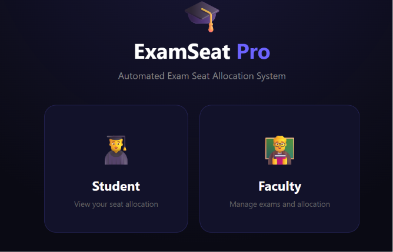
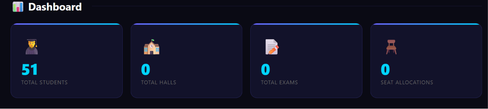
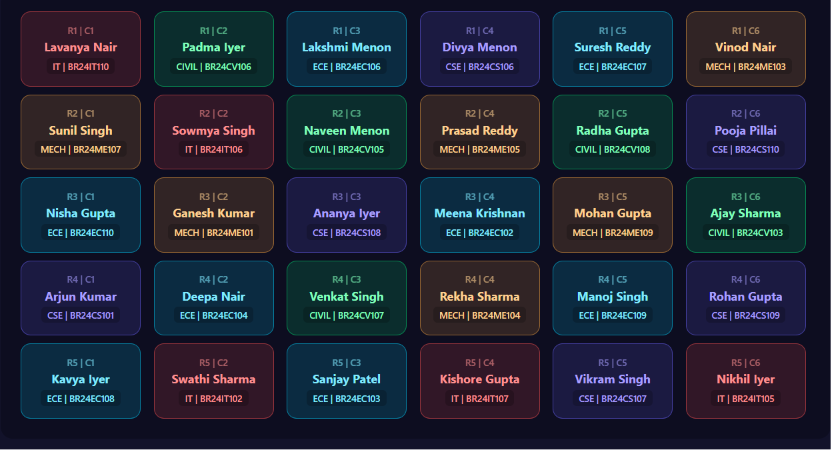
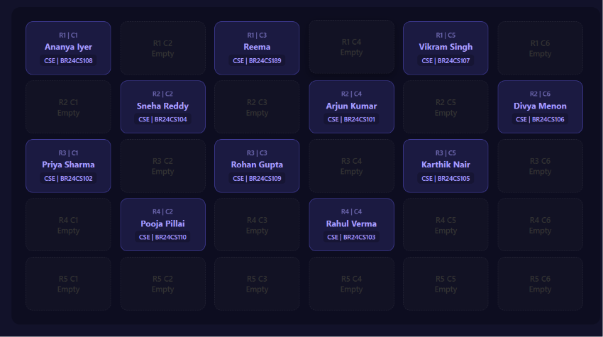

#  ExamSeat Pro — Automated Exam Seat Allocation System

> A full-stack web application that automates examination seat allocation using **Graph Coloring** and **Backtracking** algorithms — guaranteeing that no two students from the same department ever sit adjacent to each other.

[](https://www.oracle.com/java/)
[](https://spring.io/projects/spring-boot)
[](https://www.mysql.com/)
[](https://developer.mozilla.org/en-US/docs/Web/JavaScript)

---

##  Overview

Manual exam seat allocation is slow, error-prone, and does little to prevent malpractice — students from the same class routinely end up sitting next to each other. **ExamSeat Pro** solves this by modeling the examination hall as a graph (seats = nodes, adjacency = edges, departments = colors) and computing a provably conflict-free seating arrangement in seconds, not hours.

The system ships with two portals:
- ** Student Portal** — log in with a USN to instantly view exam name, date, time, hall, row, column, and seat number, with a one-click print option.
- ** Faculty Portal** — manage students (individually or via CSV bulk upload), halls, and exams, then generate and visually inspect seat allocations on a live bench-grid layout.

---

##  Key Features

| Feature | Description |
|---|---|
|  **Graph Coloring + Backtracking** | For multi-department exams, guarantees zero adjacent same-department seating using constraint-satisfaction backtracking. |
|  **Checkerboard Allocation** | For single-department exams, places students on alternating seats so every student is surrounded by empty seats on all four sides. |
|  **Dynamic Hall Selection** | Automatically sorts halls by capacity and fills the smallest hall first, minimizing the number of halls used. |
|  **Hall Conflict Prevention** | Detects halls already in use by an overlapping exam and excludes them from allocation, so two exams never share a room. |
|  **Time-Conflict Detection** | Rejects a new exam if it overlaps another exam already scheduled for the same department/year, preventing a student from being double-booked. |
|  **Auto-Expiring Exams** | After completion of  exams the allocated seats are taken back once their end time has passed — no manual cleanup needed. |
|  **CSV Bulk Upload** | Onboard dozens of students in one upload instead of typing each one in by hand. |
|  **Live Search & Confirm-Delete** | Instant client-side search over the student table, with a confirmation modal guarding every delete action. |
|  **Print-Ready Seat Charts** | Dedicated print stylesheet renders a clean, ink-friendly seating chart for both faculty and students. |
|  **Real-Time Dashboard** | Live counts of students, halls, exams, and allocations pulled directly from the REST API. |

---

##  Tech Stack

**Backend**
- Java 21 · Spring Boot 3.5 · Spring Data JPA / Hibernate
- MySQL 8.0
- Lombok

**Frontend**
- HTML · CSS  · Vanilla JavaScript (Fetch API)

**Tooling**
- IntelliJ IDEA (backend) · VS Code + Live Server (frontend) · MySQL Workbench

---

##  System Architecture and Design

```
┌──────────────────────────────────────┐
│              Frontend                │
│   HTML + CSS + JavaScript            │
│   Student Portal  |  Faculty Portal  │
└──────────────────┬────────────────────┘
                   │  REST (fetch)
┌──────────────────▼────────────────────┐
│               Backend                 │
│   Spring Boot — Controller → Service  │
│        → Repository (JPA)             │
└──────────────────┬────────────────────┘
                   │  Hibernate / JDBC
┌──────────────────▼────────────────────┐
│               MySQL                   │
│  students · halls · exams ·           │
│  seat_allocations                     │
└────────────────────────────────────────┘
```

---

## For Backend Refer

- GitHub link : [https://github.com/Su-ma679/examseatallocation-backend]

##  Database Schema

| Table | Purpose |
|---|---|
| `students` | Stores student name, USN (unique), department, and year. |
| `halls` | Stores hall name, rows, columns, and computed total seats. |
| `exams` | Stores subject code (PK), subject name, date, start/end time, target department, and year. |
| `seat_allocations` | Junction table linking a student ↔ exam ↔ hall with a specific row/column. |

---

##  Algorithms

### 1. Graph Coloring + Backtracking *(multi-department exams)*
Each seat is a graph node; adjacency (up/down/left/right) forms the edges; each department is a "color." The algorithm recursively assigns students to seats, backtracking whenever a seat has no valid (non-conflicting) student left to place.

- **Time Complexity:** O(S) best case → O(S × D) average → exponential worst case (rare with multiple departments)
- **Space Complexity:** O(S) for the seat-color map + O(N) recursion depth

### 2. Checkerboard Pattern *(single-department exams)*
Students are placed only on seats where `(row + col) % 2 == 0`, guaranteeing every occupied seat has empty neighbors on all four sides.

- **Time Complexity:** O(S) — every seat visited once, no backtracking

### 3. Dynamic Hall Selection
Halls are sorted ascending by capacity and filled smallest-first until total capacity meets the student count, minimizing the number of rooms used per exam.

### 4. Time-Conflict Detection
Before saving a new exam, the system scans existing exams for the same department/year on the same date and rejects the request if the time intervals overlap.

---

##  Getting Started

### Prerequisites
- JDK 17+ (project built with Java 26)
- MySQL 8.0
- Node-free frontend — just a static file server (e.g., VS Code Live Server)

### 1. Clone the repository
```bash
git clone https://github.com/<your-username>/examseat-pro.git
cd examseat-pro
```

### 2. Set up the database
```sql
CREATE DATABASE examdb;
```

### 3. Configure the backend
Edit `src/main/resources/application.properties`:
```properties
spring.datasource.url=jdbc:mysql://localhost:3306/examdb
spring.datasource.username=root
spring.datasource.password=your_password
spring.jpa.hibernate.ddl-auto=update
```

### 4. Run the backend
```bash
cd backend
./mvnw spring-boot:run
```
Backend starts on **`http://localhost:8080`**.

### 5. Run the frontend
Open `frontend/index.html` with Live Server (or any static server) — defaults to **`http://localhost:5500`**.

### 6. Log in
| Role | Credentials |
|---|---|
| Faculty | `admin` / `admin123` |
| Student | Any registered USN |

---

##  Screenshots

### Mainmenu Page


### Dashboard Page


### Seat Allocation(Exam to all branch students)


### Seat Allocation(Exam to only one branch students)


##  Demo Video

[](https://youtu.be/5Gi5tZ0wn9c)


##  API Reference

| Method | Endpoint | Description |
|---|---|---|
| `GET` | `/api/students/all` | Fetch all students |
| `POST` | `/api/students/add` | Add a student |
| `DELETE` | `/api/students/delete/{id}` | Delete a student |
| `GET` | `/api/halls/all` | Fetch all halls |
| `POST` | `/api/halls/add` | Add a hall |
| `DELETE` | `/api/halls/delete/{id}` | Delete a hall |
| `GET` | `/api/exams/all` | Fetch all exams |
| `POST` | `/api/exams/add` | Schedule an exam (with conflict check) |
| `DELETE` | `/api/exams/delete/{id}` | Delete an exam |
| `POST` | `/api/allocation/generate/{examId}` | Run the allocation algorithm |
| `GET` | `/api/allocation/{examId}` | Get allocation for an exam |
| `GET` | `/api/allocation/student/{usn}` | Get a student's seat across all exams |
| `GET` | `/api/allocation/all` | Get every allocation (used by dashboard) |

---

##  Project Structure

```
examseat-pro/
├── backend/
│   └── src/main/java/com/exam/seatallocation/
│       ├── controller/     
│       ├── service/        
│       ├── repository/      
│       └── model/           
│
└── frontend/
    ├── index.html           
    ├── dashboard.html       
    ├── students.html         
    ├── halls.html             
    ├── exams.html             
    ├── allocation.html         
    ├── student-view.html       
    ├── css/style.css
    └── js/
```

---

##  Future enhancements

- [ ] JWT-based authentication
- [ ] Email/SMS seat notifications
- [ ] Cloud deployment (Railway + Netlify)
- [ ] DSatur-based coloring for improved average-case allocation speed
- [ ] Mobile app companion

---

##  Author

Built as an Analysis & Design of Algorithms (ADA) and DBMS mini-project, demonstrating practical applications of **graph theory**, **backtracking**, and **relational database design** in a real-world institutional workflow.

If you found this project interesting, consider giving it a ⭐!
